## 个人博客系统后端

> 基于`Go`语言、`Gin`框架和`GORM`库开发的个人博客系统后端,实现博客文章的基本管理功能,包括文章的创建、读写、更新和删除(`CRUD`)操作,同时支持用户认证和评论功能.


## 一、技术栈功能介绍

### 1.1.核心功能
- **用户认证**: 用户注册、登录、`JWT`令牌认证
- **文章管理**: 文章的创建、读取、更新、删除(`CRUD`)
- **评论系统**: 文章评论的创建和读取
- **权限控制**: 只有文章作者才能修改/删除自己的文章
- **数据关联**: 用户、文章、评论之间的关联关系


### 1.2.技术栈

- **语言**: ` Go 1.21+`
- **`Web`框架**:  `Gin`
- **`ORM`**:  `GORM`
- **数据库**:  `MySQL 8.0`
- **认证**: `JWT`(`JSON Web Token`)
- **密码加密**:  `bcrypt`
- **配置管理**:  `godotenv`
- **日志**:  `Gin`内置日志
- **`API`文档**: `Swagger`(`swaggo`)


### 1.3.技术特性

- **密码加密**: 使用`bcrypt`加密存储用户密码
- **`JWT`认证**: 使用`JSON Web Token`实现用户认证
- **数据库**: 使用`MySQL`数据库，支持自动迁移
- **日志记录**: 完整的请求日志和错误处理
- **`CORS`支持**: 跨域资源共享支持


## 二、本地环境搭建

### 2.1.`MySQL`数据库

```bash
# 1.创建本地挂在目录
mkdir -pv ./{conf.d,data,init,logs}

# 2.创建MySQL配置文件内容
vim conf.d/mysql.cnf 

[mysqld]
# 基础配置
character-set-server=utf8mb4
collation-server=utf8mb4_unicode_ci

# 系统命令配置
#system-command=1

# 连接配置
max_connections=1000
wait_timeout=28800
interactive_timeout=28800

# InnoDB配置
innodb_buffer_pool_size=1G
innodb_flush_log_at_trx_commit=1
innodb_file_per_table=1

# 日志配置
slow_query_log=1
slow_query_log_file=/var/log/mysql/slow.log
long_query_time=2
general_log=1
general_log_file=/var/log/mysql/general.log

# 安全配置
skip_name_resolve=1

# 时区设置
default-time-zone='+8:00'

[mysql]
default-character-set=utf8mb4

[client]
default-character-set=utf8mb4


# 3.创建docker-compose.yml容器编排文件
vim docker-compose.yml

version: '3.8'

services:
  mysql:
    image: mysql:8.4
    #image: mysql:8.0.43
    container_name: mysql-8043
    restart: always
    environment:
      # MySQL root用户密码
      MYSQL_ROOT_PASSWORD: root123456
      # 创建新数据库
      MYSQL_DATABASE: myapp
      # 创建新用户
      MYSQL_USER: appuser
      MYSQL_PASSWORD: app123456
      # 字符集设置
      MYSQL_CHARACTER_SET_SERVER: utf8mb4
      MYSQL_COLLATION_SERVER: utf8mb4_unicode_ci
      # 时区设置
      TZ: Asia/Shanghai
    volumes:
      # 数据持久化
      - ./data:/var/lib/mysql
      # 配置文件挂载
      - ./conf.d:/etc/mysql/conf.d
      # 初始化脚本
      - ./init:/docker-entrypoint-initdb.d
      # 日志目录
      - ./logs:/var/log/mysql
    ports:
      # 端口映射：主机端口:容器端口
      - "3306:3306"
    healthcheck:
      test: ["CMD", "mysqladmin", "ping", "-h", "localhost", "-u", "root", "-proot123456"]
      interval: 30s
      timeout: 10s
      retries: 5
      start_period: 60s
    logging:
      driver: "json-file"
      options:
        max-size: "100m"
        max-file: "3"
        

```


- **运行`MySQL`容器**

```bash
# 启动容器
docker-compose up -d 

# 查看日志
docker-compose logs --tail 100 -f
```


## 

### 2.1.博客项目配置

#### 项目配置文件调整

```bash
# 1.克隆项目
git clone https://github.com/banna2019/WEB3-STUDY.git

# 2.进入项目目录
cd WEB3-STUDY/GO-BLOG/blog-system


# 3.使用脚本生成JWT_SECRET,后面.env配置调整需要使用
✗ ./generate_jwt_secret.sh 
🔐 生成JWT密钥...

方法1 - 使用OpenSSL:
JWT_SECRET=Mi8YDAiawA04ahOKT0nBPoOzll/WAHFp1BAb66HorbaIHZltkyfbmecelpUGer7r
ratjLwF2vSpvkjTgXE1hiQ==

方法2 - 使用Go:
JWT_SECRET=GZxFC24UPaAv3HUqDkIahGB0JmdL-61wEhkrwDYyC9MqRnCN4cDmx-1dvflJliWqJSeMMTbFbP6TReHU3yPr7g==

方法3 - 使用/dev/urandom:
JWT_SECRET=UvPh7fGkjOAQ7vJixCIzlxFALo4PMIy+FFi9fEH3TolqeqWN8+SxVg1JvOjjyoVYy6ePi7STfFCx3hrHxr7KxA==

✅ 请选择其中一个密钥并更新您的.env文件
⚠️  注意: 请妥善保管您的JWT密钥，不要泄露给他人


# 4.复制本地使用.env环境变量文件,并进行修改
cp -rp env.example .env
vim .env

# 环境变量配置示例
# 复制此文件为 .env 并修改相应的配置值

# 数据库配置
DB_HOST=localhost
DB_PORT=3306
DB_USERNAME=root
DB_PASSWORD=root123456
DB_NAME=blog_system
DB_CHARSET=utf8mb4
DB_PARSE_TIME=true
DB_LOC=Local

# 服务器配置
SERVER_PORT=8080
SERVER_HOST=0.0.0.0

# JWT配置
# 请使用以下命令生成安全的JWT密钥:
# openssl rand -base64 64
# 或者使用Go: go run -c 'package main; import ("crypto/rand"; "encoding/base64"; "fmt"); func main() { b := make([]byte, 64); rand.Read(b); fmt.Println(base64.URLEncoding.EncodeToString(b)) }'
JWT_SECRET=GZxFC24UPaAv3HUqDkIahGB0JmdL-61wEhkrwDYyC9MqRnCN4cDmx-1dvflJliWqJSeMMTbFbP6TReHU3yPr7g==
JWT_EXPIRE_HOURS=24

# 日志配置
# 可以设置的日志级别有debug、info
LOG_LEVEL=debug
LOG_FORMAT=json

# 应用配置
APP_NAME=Blog System
APP_VERSION=1.0.0
APP_ENV=development

```


#### 配置说明

##### 数据库配置

- `DB_HOST`: `MySQL`服务器地址 (默认: `localhost`)
- `DB_PORT`: `MySQL`端口号 (默认: 3306)
- `DB_USERNAME`: 数据库用户名 (默认: `root`)
- `DB_PASSWORD`: 数据库密码 (默认: `password`)
- `DB_NAME`: 数据库名称 (默认: `blog_system`)
- `DB_CHARSET`: 字符集 (默认: `utf8mb4`)
- `DB_PARSE_TIME`: 是否解析时间 (默认: `true`)
- `DB_LOC`: 时区 (默认: `Local`)

##### 服务器配置

- `SERVER_PORT`: 服务器端口号 (默认: 8080)
- `SERVER_HOST`: 服务器地址 (默认: 0.0.0.0)

##### `JWT`配置

- `JWT_SECRET`: JWT密钥 (默认: `your_secret_key_change_in_production`)
- `JWT_EXPIRE_HOURS`: `Token`有效期(小时) (默认: 24)

**重要**: `JWT_SECRET`必须手动生成一个安全的密钥,不要使用默认值！


##### 日志配置

- `LOG_LEVEL`: 日志级别 (默认: `info`)
- `LOG_FORMAT`: 日志格式 (默认: `json`)

##### 应用配置

- `APP_NAME`: 应用名称 (默认: `Blog System`)
- `APP_VERSION`: 应用版本 (默认: 1.0.0)
- `APP_ENV`: 运行环境 (默认: `development`)


### 2.3.主程序配置运行

```bash
# 1.克隆项目
git clone https://github.com/banna2019/WEB3-STUDY.git

# 2.进入项目目录
cd WEB3-STUDY/GO-BLOG/blog-system

# 3.通过go mod下载项目依赖包
go mod tidy


# 4.swagger插件安装
## 安装swag命令行工具
go install github.com/swaggo/swag/cmd/swag@latest

## 验证安装
swag --version


# 运行项目
go run main.go
```

**备注:**

> 服务器将在 `http://localhost:8080` 启动
> 
> **`Swagger API`文档**: `http://localhost:8080/swagger/index.html`


## 三、数据模型与API`接口

### 3.1.数据模型

#### `User`(用户表)

```go
type User struct {
    ID        uint      `gorm:"primaryKey" json:"id"`
    Username  string    `gorm:"unique;not null" json:"username"`
    Password  string    `gorm:"not null" json:"-"`
    Email     string    `gorm:"unique;not null" json:"email"`
    CreatedAt time.Time `json:"created_at"`
    UpdatedAt time.Time `json:"updated_at"`
    
    Posts    []Post    `gorm:"foreignKey:UserID" json:"posts,omitempty"`
    Comments []Comment `gorm:"foreignKey:UserID" json:"comments,omitempty"`
}
```


#### `Post`(文章表)

```go
type Post struct {
    ID        uint      `gorm:"primaryKey" json:"id"`
    Title     string    `gorm:"not null" json:"title"`
    Content   string    `gorm:"not null" json:"content"`
    UserID    uint      `json:"user_id"`
    CreatedAt time.Time `json:"created_at"`
    UpdatedAt time.Time `json:"updated_at"`
    
    User     User      `gorm:"foreignKey:UserID" json:"user,omitempty"`
    Comments []Comment `gorm:"foreignKey:PostID" json:"comments,omitempty"`
}
```


#### `Comment`(评论表)

```go
type Comment struct {
    ID        uint      `gorm:"primaryKey" json:"id"`
    Content   string    `gorm:"not null" json:"content"`
    UserID    uint      `json:"user_id"`
    PostID    uint      `json:"post_id"`
    CreatedAt time.Time `json:"created_at"`
    UpdatedAt time.Time `json:"updated_at"`
    
    User User `gorm:"foreignKey:UserID" json:"user,omitempty"`
    Post Post `gorm:"foreignKey:PostID" json:"post,omitempty"`
}
```


### 3.2.`API`接口

#### 基础信息
- **`Base URL`**: `http://localhost:8088/api`
- **`Content-Type`**: `application/json`
- **认证方式**:  `Bearer Token`(`JWT`)
- **`Swagger`文档**: `http://localhost:8088/swagger/index.html`


#### 认证要求说明

**重要提醒**: 除了用户注册(`POST /api/register`)和用户登录(`POST /api/login`)接口外,**所有其他`API`接口都需要`JWT`认证**！

- **1.认证方式**:
  - **请求头**: `Authorization: Bearer <JWT_TOKEN>`
  - **获取方式**: 通过`POST /api/login`接口获取JWT令牌
  - **令牌有效期**: 24小时（可在配置文件中修改）

- **2.需要认证的接口**:
  - **文章管理**: `GET /api/posts`, `GET /api/posts/{id}`, `GET /api/latest-post`
  - **文章操作**: `POST /api/posts`, `PUT /api/posts/{id}`, `DELETE /api/posts/{id}`
  - **评论管理**: `GET /api/posts/{id}/comments`, `GET /api/comments/{id}`
  - **评论操作**: `POST /api/posts/{id}/comments`, `PUT /api/comments/{id}`, `DELETE /api/comments/{id}`

- **3.公开接口**:
  - **用户注册**: `POST /api/register`
  - **用户登录**: `POST /api/login`


### 3.3.`Swagger`文档特性

- **在线测试**: 直接在浏览器中测试`API`接口
- **参数验证**: 自动验证请求参数格式
- **认证支持**: 支持`JWT Bearer Token`认证
- **响应示例**: 提供完整的请求和响应示例
- **接口分组**: 按功能模块分组显示接口


## 四、`PostMan`测试`API`接口功能

### 4.1.项目常见错误码

- `400`: 请求参数错误
- `401`: 未授权/认证失败
- `403`: 权限不足
- `404`: 资源不存在
- `409`: 资源冲突(如用户名已存在)
- `500`: 服务器内部错误


### 4.2.需要测试的功能项

#### 用户认证

- **注册用户**: 使用`POST /api/register`接口

- **用户登录**: 使用`POST /api/login`接口

  > **这里除了测试用户的登录功能之外,还会将新注册用户的"用户名"和生成的`token`;获取到写入到`postman`中的全局变量"registered_username"、"jwt_token"中,以方便后面的测试项目直接调用使用**

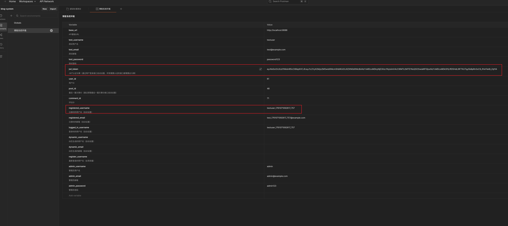


#### 文章管理

- 创建文章: 使用`POST /api/posts`接口
  - 获取所有文章: 使用`GET /api/posts`接口
  - 获取单个文章: 使用`GET /api/posts/{{post_id}}`接口 (这里的`{{post_id}}`变量定义在`postman`全局变量中,下面调用的变脸也是定义在全局变量中)
  - 更新文章:  使用`PUT /api/posts/{{post_id}}`接口
  - 删除文章:  使用`DEL /api/posts/{{post_id}}`接口


#### 评论功能

- 获取评论数据表中最后一条数据的`ID`: 使用`GET /api/latest-post`接口

  > **这里多设置"获取评论数据表中最后一条数据的ID",是因为要拿到评论数据表中最后一条数据的`ID`;在`postman`全局变量中设置"post_id"变量,方便后续测试项目的调用**

  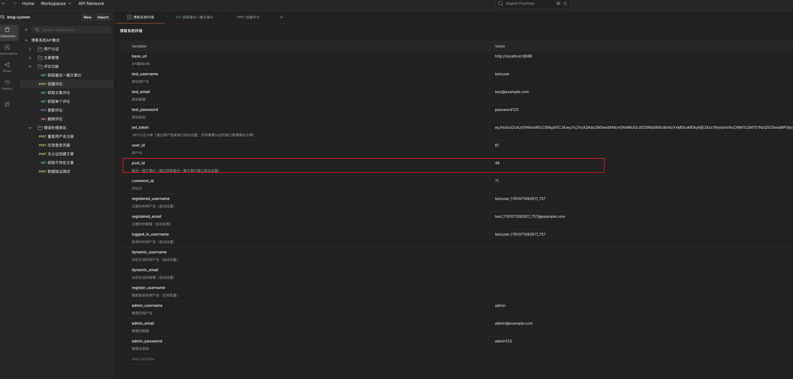

- 创建评论: 使用`POST /api/posts/{{post_id}}/comments`接口 (这里的`{{post_id}}`变量定义在`postman`全局变量中,下面调用的变脸也是定义在全局变量中)

- 获取文章评论: 使用`GET /api/posts/{{post_id}}/comments`接口

- 获取单个评论： 使用`GET /api/comments/{{comment_id}}`接口

- 更新评论: 使用`PUT /api/comments/{{comment_id}}`接口

- 删除评论: 使用`DEL /api/comments/{{comment_id}}`接口


#### 错误处理测试

- 重复注册用户: 使用`POST /api/register`接口
- 无效登录凭据: 使用`POST /api/login`接口
- 无认证创建文章: 使用`POST /api/posts`接口
- 获取不存在的文章: 使用`GET /api/posts/99999`接口
- 数据验证测试: 使用`POST /api/posts`接口


### 4.3.`PostMan`导入测试数据模板

#### `postman`目录介绍

```bash
➜  postman git:(main) ✗ tree ./
./
├── collections
│   └── blog-system-api.json            # 这里是需要导入测试的API接口模板
└── environments
    └── blog-system-environment.json    # 这里是全局可被调用的环境变量

3 directories, 2 files
```


#### 导入测试模板数据

```bash
# 1.克隆项目
~ git clone https://github.com/banna2019/WEB3-STUDY.git

# 2.进入项目目录
~ cd WEB3-STUDY/GO-BLOG/blog-system/postman
~ ls
collections  environments
```


##### 1.导入`API`接口模板


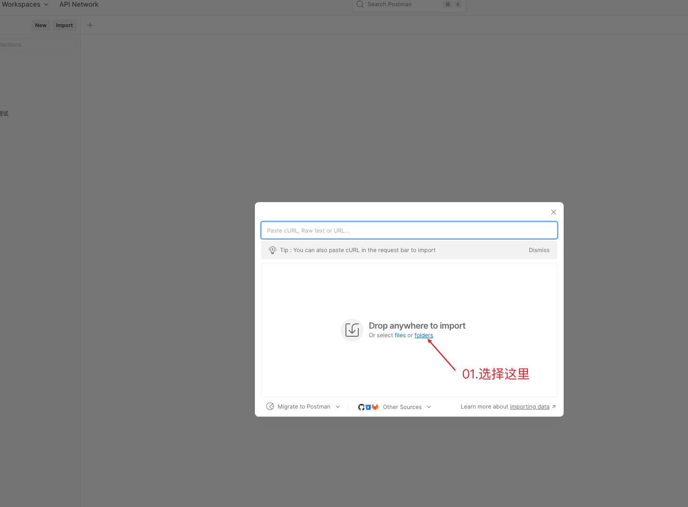

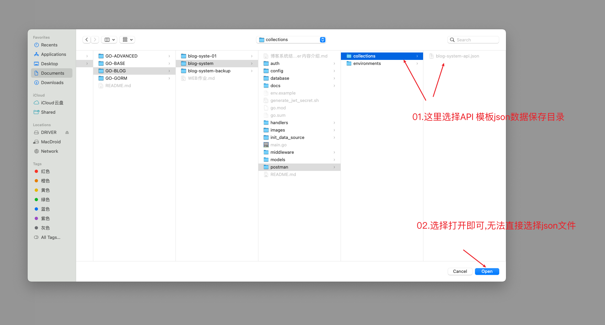

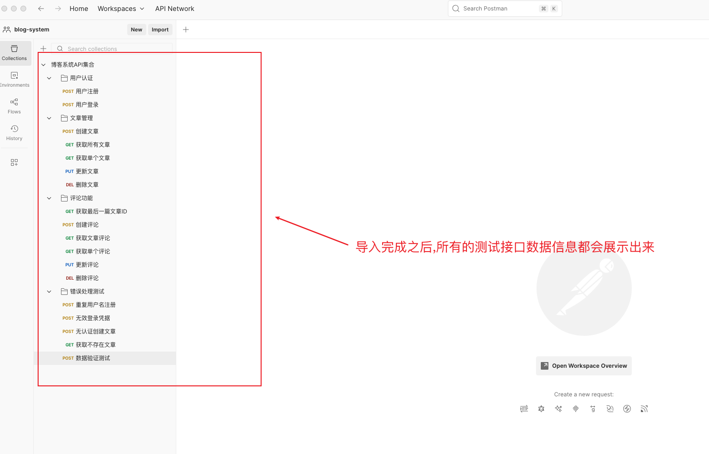


##### 2.导入全局变量配置

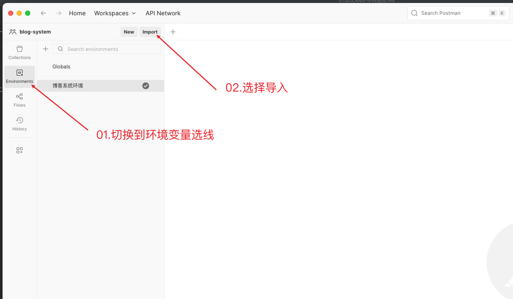

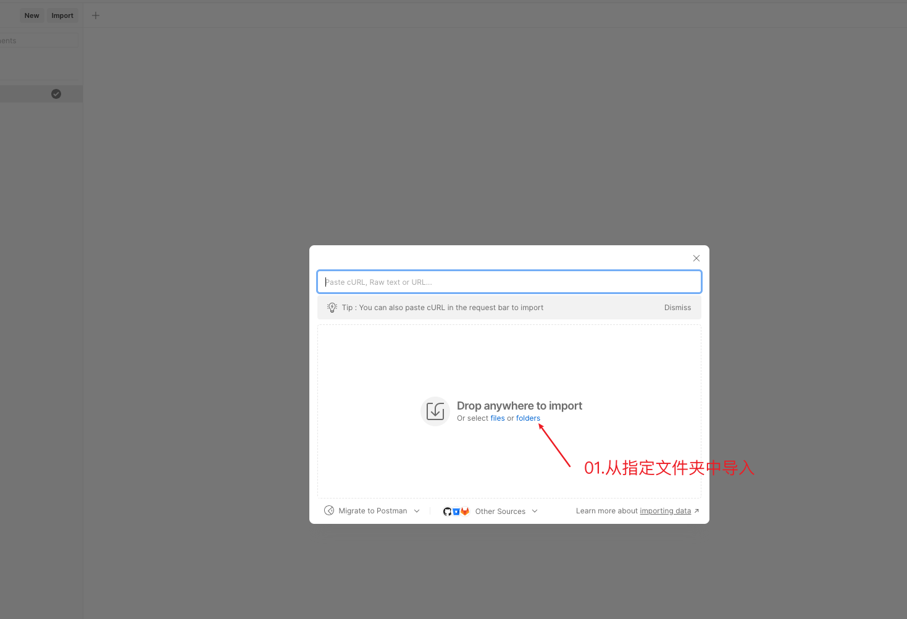

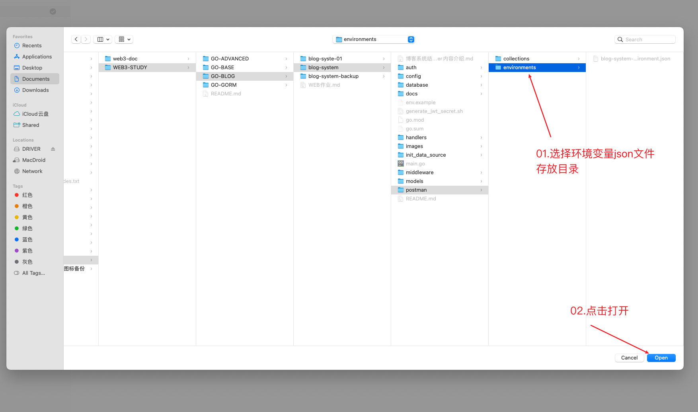

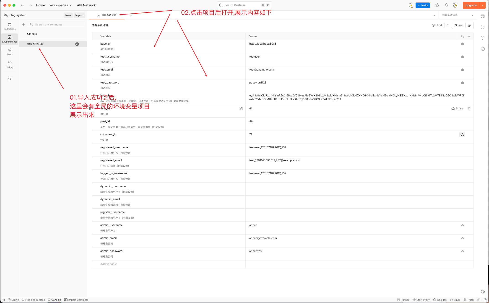


##### 3.设置默认全局环境变量

> **这里不设置的话使用`API`接口模板进行测试无法,调用到全局变量中的内容;完成这里之后就可以开始各项功能测试了**

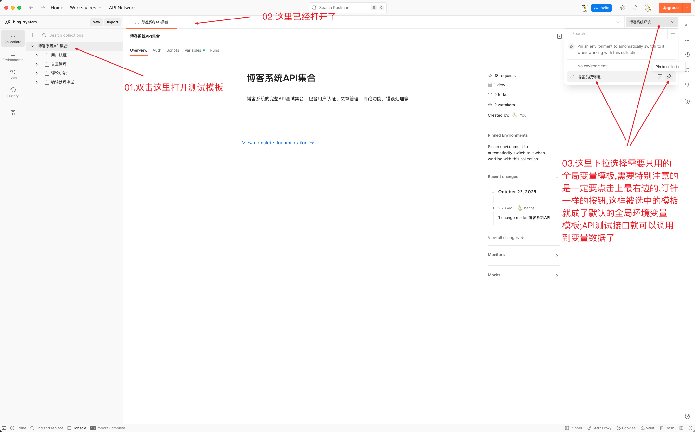

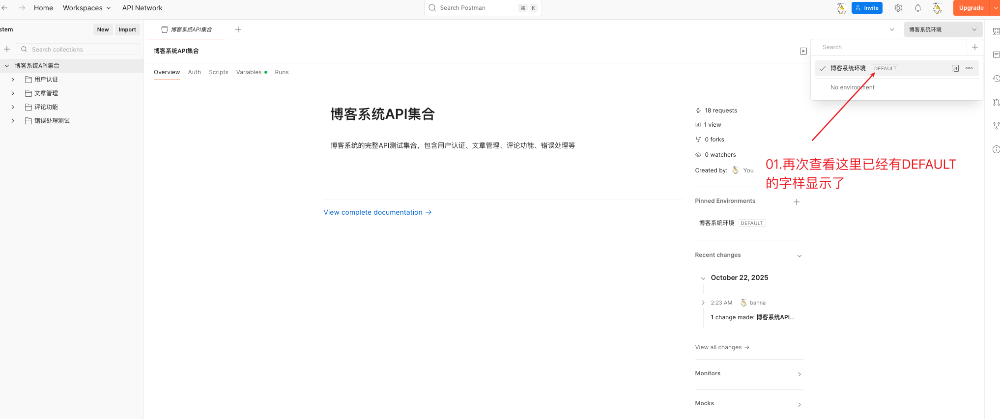


