# MetaStake-Token项目逻辑流程图

本文档详细描述了`MetaStake-Token`质押系统的核心逻辑流程

## 一、目录

- 1.[系统架构概览](#系统架构概览)
- 2.[部署流程](#部署流程)
- 3.[质押流程](#质押流程)
- 4.[解质押流程](#解质押流程)
- 5.[领取奖励流程](#领取奖励流程)
- 6.[Uniswap交换流程](#uniswap交换流程)
- 7.[奖励分配机制](#奖励分配机制)
- 8.[池管理流程](#池管理流程)
- 9.[合约升级流程](#合约升级流程)
- 10.[紧急操作流程](#紧急操作流程)


## 二、系统架构概览

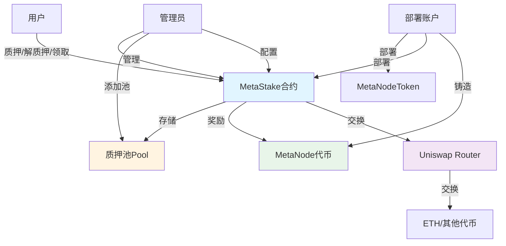


## 三、部署流程

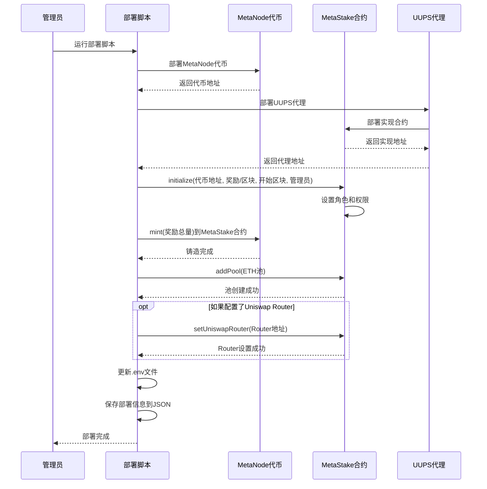


## 四、质押流程

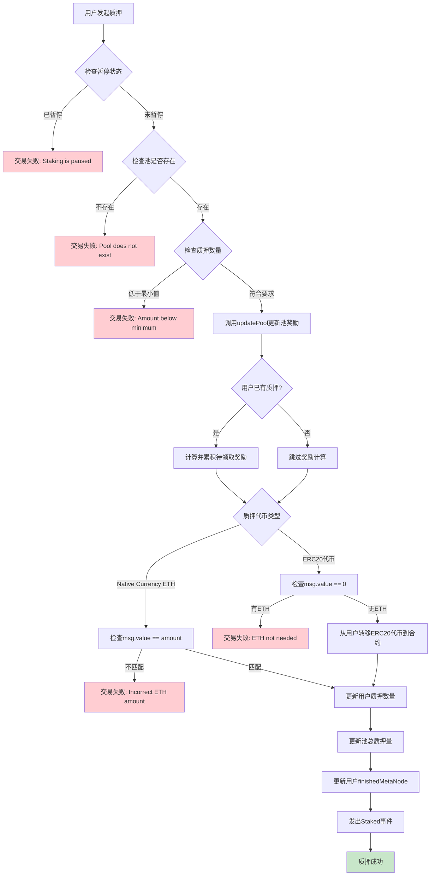


## 五、解质押流程

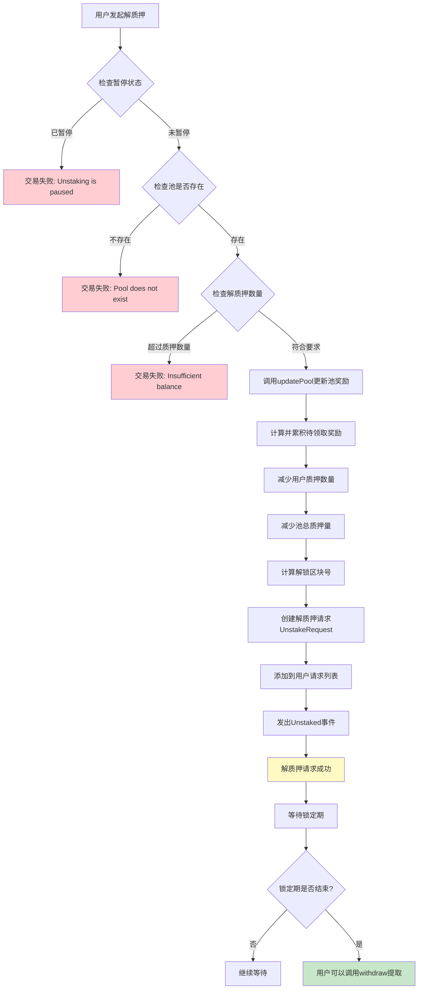


## 六、领取奖励流程

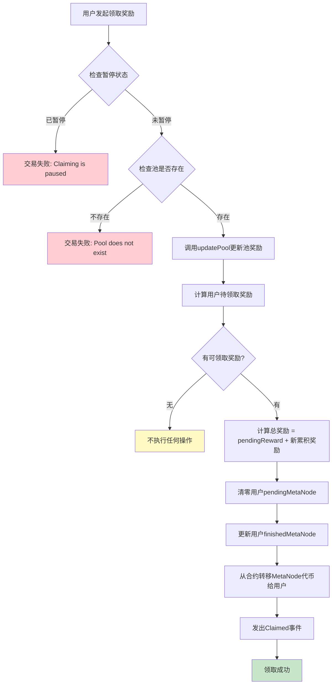


## 七、Uniswap交换流程

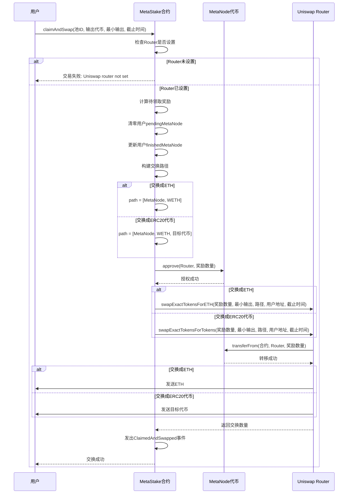


## 八、奖励分配机制

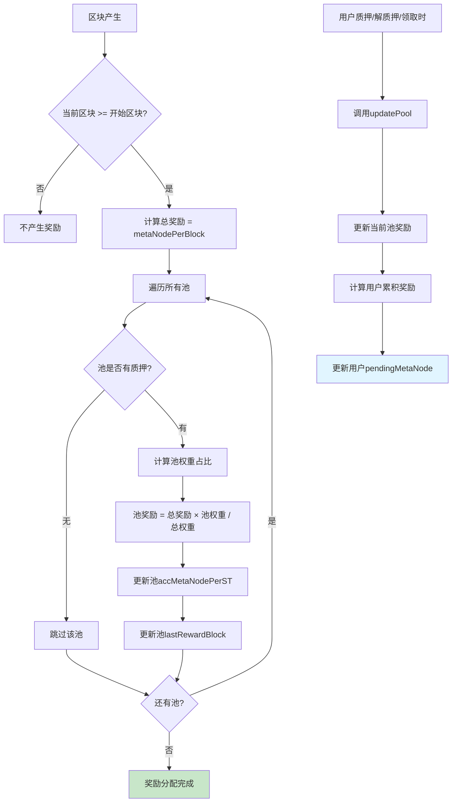

### 8.1.奖励计算公式

```
1.池奖励 = metaNodePerBlock × (池权重 / 所有池权重之和)
2.accMetaNodePerST += (池奖励 × 1e18) / 池总质押量
3.用户待领取奖励 = (用户质押量 × accMetaNodePerST) / 1e18 - 用户finishedMetaNode
```


## 九、池管理流程

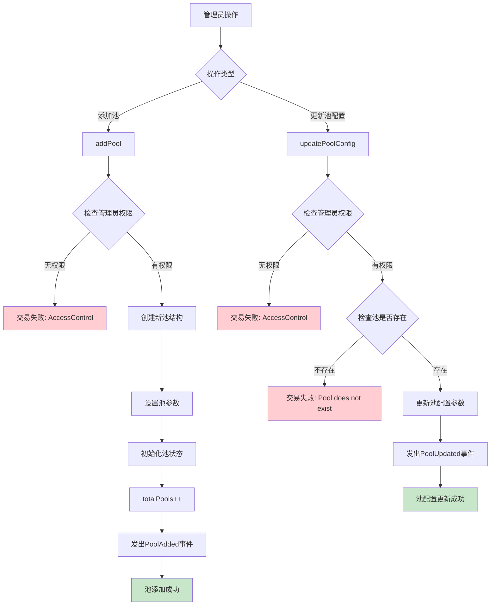


## 十、合约升级流程

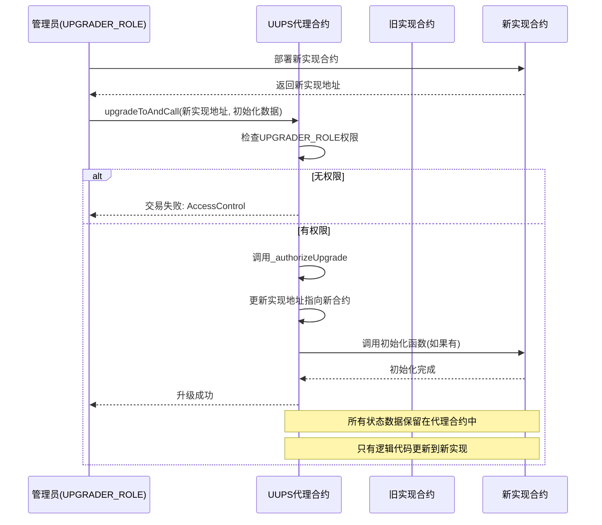


## 十一、紧急操作流程

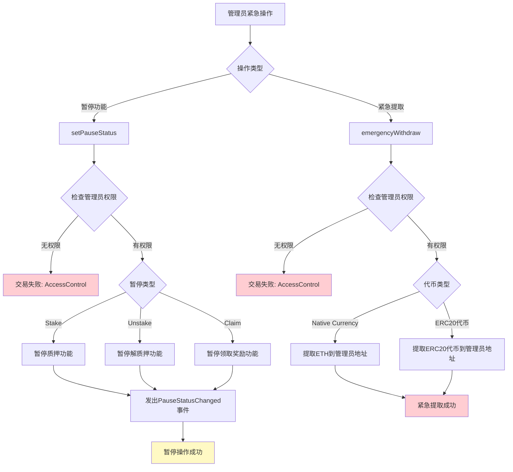


## 十二、完整用户交互流程

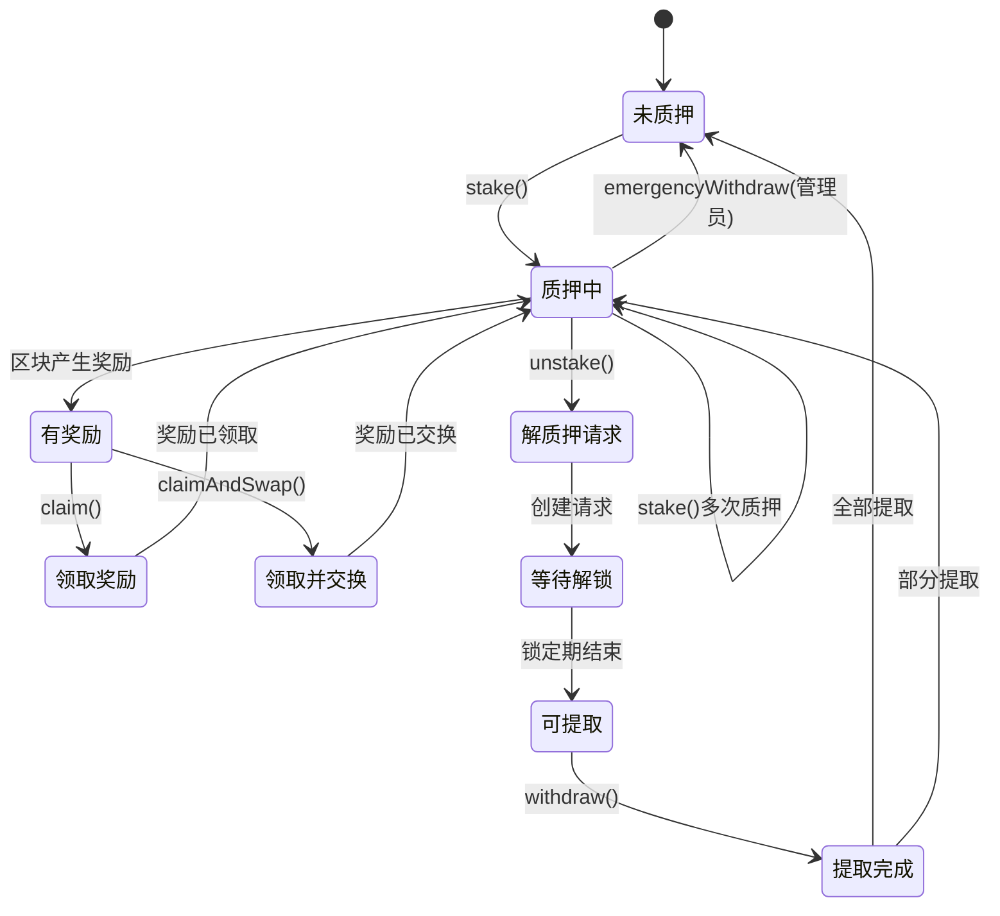


## 十三、数据流图

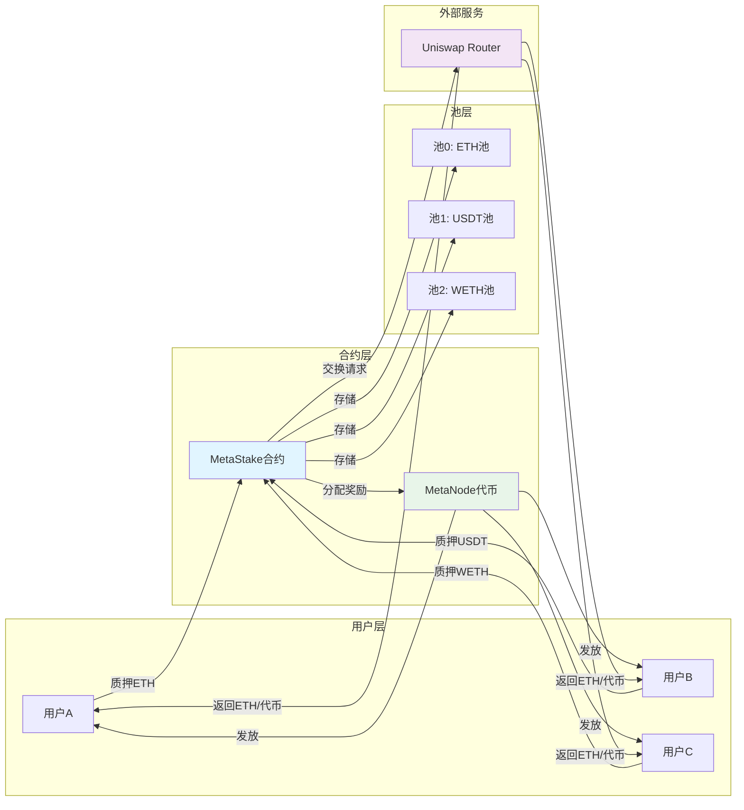


## 十四、关键函数调用关系

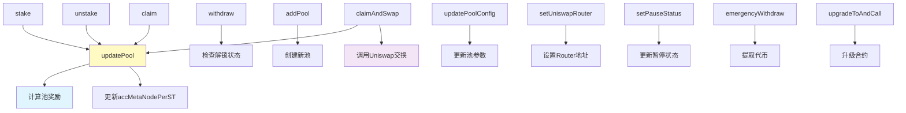


## 十五、权限控制矩阵

| 功能 | DEFAULT_ADMIN_ROLE | ADMIN_ROLE | UPGRADER_ROLE | 普通用户 |
|------|-------------------|------------|---------------|----------|
| 质押 | ✅ | ✅ | ✅ | ✅ |
| 解质押 | ✅ | ✅ | ✅ | ✅ |
| 领取奖励 | ✅ | ✅ | ✅ | ✅ |
| 添加池 | ✅ | ✅ | ❌ | ❌ |
| 更新池配置 | ✅ | ✅ | ❌ | ❌ |
| 设置Router | ✅ | ✅ | ❌ | ❌ |
| 暂停功能 | ✅ | ✅ | ❌ | ❌ |
| 紧急提取 | ✅ | ✅ | ❌ | ❌ |
| 升级合约 | ✅ | ❌ | ✅ | ❌ |
| 设置奖励率 | ✅ | ✅ | ❌ | ❌ |


## 十六、状态转换说明

### 16.1.用户状态转换

- **1.未质押 → 质押中**
  - 触发: `stake()`
  - 条件: 数量 >= 最小质押金额
  - 结果: `user.stAmount` 增加
- **2.质押中 → 有奖励**
  - 触发: 区块产生奖励
  - 条件: 区块 >= startBlock
  - 结果: `user.pendingMetaNode` 累积
- **3.有奖励 → 质押中**
  - 触发: `claim()` 或 `claimAndSwap()`
  - 条件: 有可领取奖励
  - 结果: 奖励已发放,`pendingMetaNode` 清零
- **4.质押中 → 解质押请求**
  - 触发: `unstake()`
  - 条件: 解质押数量 <= 质押数量
  - 结果: 创建 `UnstakeRequest`,等待解锁
- **5.解质押请求 → 可提取**
  - 触发: 区块号 >= unlockBlock
  - 条件: 锁定期结束
  - 结果: 可以调用 `withdraw()`
- **6.可提取 → 未质押/质押中**
  - 触发: `withdraw()`
  - 条件: 有可提取的请求
  - 结果: 代币返回用户,请求被移除


## 十七、注意事项

- **1.奖励计算时机**

  - 每次 `stake()`, `unstake()`, `claim()` 时自动调用 `updatePool()`
  - 确保奖励计算的实时性和准确性

- **2.锁定期机制**

  - 解质押后需要等待 `unstakeLockedBlocks` 个区块
  - 锁定期内无法提取,但可以继续质押和领取奖励

- **3.多池奖励分配**

  - 根据池权重按比例分配奖励
  - 权重越大,分配的奖励越多

- **4.Uniswap集成**

  - 需要先设置`Uniswap Router`地址
  - 交换时需要考虑滑点保护(`amountOutMin`)
  - 交换路径: `MetaNode` → `WETH` → 目标代币(如需要)

- **5.合约升级**

  - 使用`UUPS`代理模式,状态数据保留在代理合约中

  - 只有逻辑代码可以升级

  - 需要`UPGRADER_ROLE`权限


