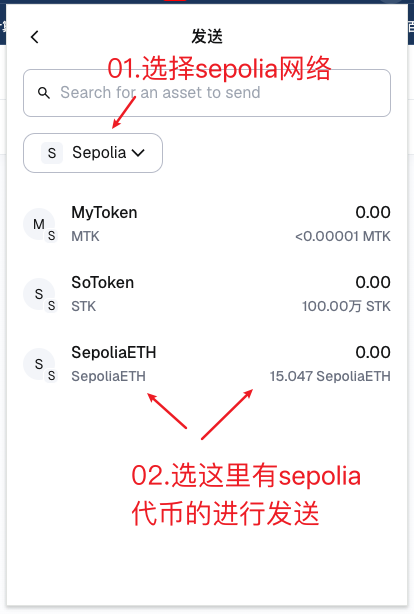
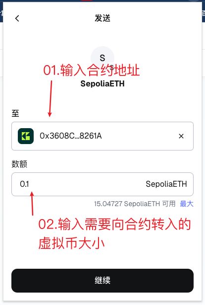
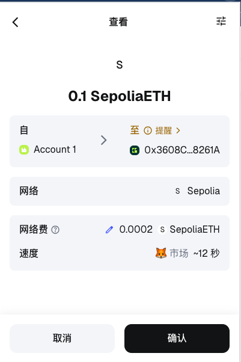
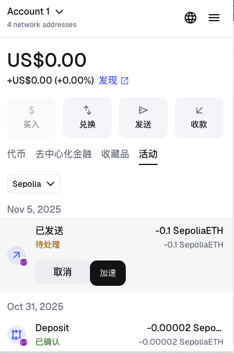
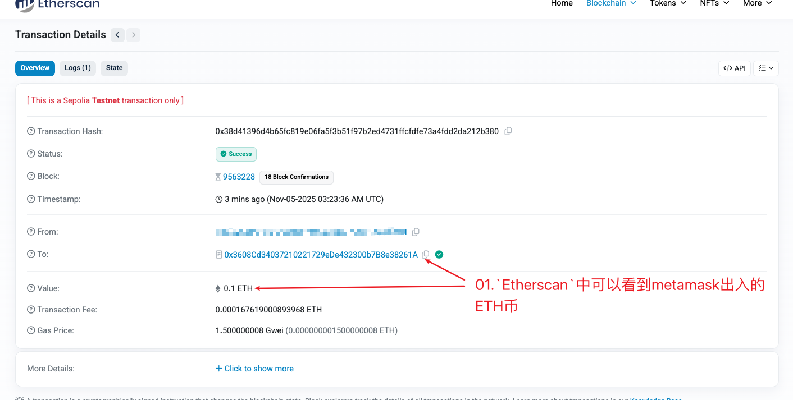

# `BeggingContract` 合约项目

基于`Hardhat`的捐赠合约项目,允许用户向合约地址发送以太币,记录捐赠信息,并允许合约所有者提取所有资金.


### 一、快速开始

#### 1.安装依赖

```bash
npm install
```


#### 2.配置环境变量

复制 `.env.example` 为 `.env` 并填写配置：

```bash
cp .env.example .env
```

编辑 `.env` 文件,设置以下变量：

**必需变量:**
- `PRIVATE_KEY`: 你的钱包私钥(用于部署合约)
- `INFURA_PROJECT_ID`: Infura Project ID(用于连接 Sepolia 测试网络)
- `ETHERSCAN_API_KEY`: Etherscan API Key(用于验证合约)

**可选变量(合约验证):**
- `CONTRACT_ADDRESS`: 合约地址(用于 verify:contract 脚本)
  - **注意**: 此变量会在部署成功后自动写入 `.env` 文件,无需手动设置
  - 部署脚本会自动更新或添加此变量


#### 3.检查配置

```bash
npm run check-config
```


#### 4.编译合约

```bash
npm run compile
```


#### 5.运行测试

```bash
# 运行所有测试
npm test

# 只运行 BeggingContract 合约测试
npm test test/BeggingContract.js
```


#### 6.部署合约

```bash
npm run deploy:sepolia
```

部署脚本会自动部署`BeggingContract`合约,并显示合约地址和相关信息.

**部署后自动保存合约地址:**
部署成功后,脚本会自动将合约地址保存到 `.env` 文件中的 `CONTRACT_ADDRESS` 变量,后续可以直接使用 `npm run verify:contract` 验证合约,无需手动设置地址.


#### 7.验证合约

```bash
# 方法 1: 使用环境变量 + verify:contract
npm run verify:contract

# 方法 2: 使用 verify:direct (推荐,最简单)
npm run verify:direct -- <合约地址>

# 方法 3: 直接使用 Hardhat
npx hardhat verify --network sepolia <合约地址>
```

**注意事项：**
- 使用 `npm run` 时,必须在命令和参数之间添加 `--` 分隔符
- 确保已设置 `ETHERSCAN_API_KEY` 环境变量
- 合约必须已部署到`Sepolia`网络
- 等待几个区块确认后再验证(通常部署后等待 5 个区块)
- `BeggingContract`合约无构造函数参数
- **重要**: `hardhat run` 命令不支持位置参数,因此 `verify:contract` 需要通过环境变量传递合约地址
- **推荐**: 使用 `verify:direct` 方法,最简单直接


### 二、项目结构

```bash
.
├── contracts/                 # Solidity 合约文件
│   ├── BeggingContract.sol   # 捐赠合约(主合约)
│   └── HelloWorld.sol        # 示例合约
├── contract/                  # 合约文件(备用目录)
│   └── BeggingContract.sol   # 捐赠合约
├── test/                      # 测试文件
│   ├── BeggingContract.js    # BeggingContract 合约自动化测试(包含30个测试用例)
│   └── HelloWorld.js         # HelloWorld 合约测试
├── scripts/                   # 部署和工具脚本
│   ├── deploy.js             # 部署脚本(包含 BeggingContract 合约部署)
│   ├── verify-contract.js     # 验证合约脚本
│   └── check-config.js        # 检查环境配置脚本
├── hardhat.config.js          # Hardhat 配置文件
└── package.json               # 项目依赖配置
```


### 三、`BeggingContract`合约文档

#### 3.1.合约概述

`BeggingContract` 是一个允许用户向合约地址发送以太币的智能合约.合约记录每个捐赠者的地址和捐赠金额,并允许合约所有者提取所有资金.


#### 3.2.主要功能

##### 1.捐赠功能

- **`donate()`** - 捐赠函数
  - 允许任何用户向合约发送以太币
  - 使用 `payable` 修饰符接收以太币
  - 自动记录捐赠者地址和金额
  - 新捐赠者会自动添加到捐赠者列表
  - 同一用户多次捐赠会累计金额
  - 触发 `Donation` 事件
  - 要求：捐赠金额必须大于 0

- **`receive()`** - 接收以太币的回退函数
  - 当合约直接收到以太币时,自动调用 `donate()` 函数
  - 支持直接向合约地址转账

- **`fallback()`** - 回退函数
  - 当调用不存在的函数且发送了以太币时,自动调用 `donate()` 函数

##### 2.提取功能

- **`withdraw()`** - 提取函数(仅所有者)
  - 只有合约所有者可以调用
  - 提取合约中的所有资金到所有者地址
  - 使用 `address.call{value: amount}("")` 安全发送资金
  - 触发 `Withdrawal` 事件
  - 要求：合约余额必须大于 0

##### 3.查询功能

- **`getDonation(address donor)`** - 查询捐赠金额
  - 返回指定地址的累计捐赠金额
  - 如果地址从未捐赠,返回 0

- **`getBalance()`** - 查询合约余额
  - 返回合约当前持有的以太币数量(以 wei 为单位)

- **`getTotalDonations()`** - 查询总捐赠金额
  - 返回所有捐赠者的累计捐赠总额

- **`getDonorCount()`** - 查询捐赠者数量
  - 返回已捐赠的地址总数

- **`getDonor(uint256 index)`** - 查询捐赠者地址
  - 返回指定索引的捐赠者地址
  - 要求：索引必须在有效范围内

- **`owner()`** - 查询合约所有者
  - 返回合约所有者地址


#### 3.3.事件

- **`Donation(address indexed donor, uint256 amount, uint256 timestamp)`**
  - 当发生捐赠时触发
  - `donor`: 捐赠者地址
  - `amount`: 捐赠金额
  - `timestamp`: 捐赠时间戳

- **`Withdrawal(address indexed owner, uint256 amount, uint256 timestamp)`**
  - 当提取资金时触发
  - `owner`: 所有者地址
  - `amount`: 提取金额
  - `timestamp`: 提取时间戳


#### 3.4.构造函数

```solidity
constructor()
```

合约无构造函数参数,部署者自动成为合约所有者.


#### 3.5.使用示例

##### 部署合约

```javascript
const BeggingContract = await ethers.getContractFactory("BeggingContract");
const beggingContract = await BeggingContract.deploy();
```

##### 捐赠以太币

```javascript
// 方法 1: 调用 donate 函数
const amount = ethers.parseEther("1");
await beggingContract.connect(donor).donate({ value: amount });

// 方法 2: 直接向合约地址转账(会自动调用 receive 函数)
await donor.sendTransaction({
  to: contractAddress,
  value: amount,
});
```

##### 查询捐赠信息

```javascript
// 查询某个地址的捐赠金额
const donation = await beggingContract.getDonation(donorAddress);

// 查询合约余额
const balance = await beggingContract.getBalance();

// 查询总捐赠金额
const total = await beggingContract.getTotalDonations();

// 查询捐赠者数量
const count = await beggingContract.getDonorCount();

// 查询指定索引的捐赠者
const donor = await beggingContract.getDonor(0);
```

##### 提取资金(仅所有者)

```javascript
await beggingContract.connect(owner).withdraw();
```


#### 3.6.测试覆盖

测试文件 `test/BeggingContract.js` 包含以下测试场景:

- **1.部署测试** - 验证合约初始化参数
- **2.donate 功能测试** - 捐赠、零金额验证、多次捐赠、多用户捐赠、余额更新
- **3.receive 和 fallback 功能测试** - 直接转账、无效函数调用
- **4.withdraw 功能测试** - 提取资金、权限控制、零余额验证、余额更新
- **5.getDonation 功能测试** - 查询捐赠金额、累计金额
- **6.查询功能测试** - 捐赠者数量、捐赠者地址、总捐赠金额、合约余额、边界检查
- **7.综合场景测试** - 完整的捐赠和提取流程、提取后继续捐赠
- **8.边界情况测试** - 最小金额、大金额捐赠


#### 3.7.安全特性

- 防止零金额捐赠
- 所有者权限控制(withdraw 功能)
- 安全的资金提取(使用 `call` 而不是 `transfer`)
- 事件记录所有重要操作
- 捐赠记录永久保存(提取资金后记录仍然保留)


#### 3.8.在 MetaMask 中使用

1. **部署合约**: 运行 `npm run deploy:sepolia` 获取合约地址

2. **捐赠以太币**:
   - 在 MetaMask 中点击"发送"

   - 输入合约地址

   - 输入要捐赠的金额

   - 确认交易

     

     

     

     

3. **查看交易**: 在 Etherscan 上查看交易详情和事件日志

   

4. **提取资金**(仅所有者):
   - 在 Etherscan 上连接到合约
   - 调用 `withdraw` 函数(需要所有者钱包)


#### 3.9.`Gas`消耗估算

- 部署合约：~415,000 gas
- `donate`：~92,000 gas(平均,首次捐赠稍高)
- `withdraw`：~32,000 gas
- 查询函数：免费(只读操作,不消耗 gas)


#### 3.10.额外功能说明

合约实现了以下额外功能(超出基本要求):

- **捐赠事件**: 记录每次捐赠的地址、金额和时间戳
- **捐赠者列表**: 记录所有捐赠者的地址,支持查询
- **总捐赠统计**: 记录总捐赠金额
- **接收函数**: 支持直接向合约地址转账,自动视为捐赠
- **回退函数**: 支持通过无效函数调用发送以太币

**可选挑战功能**:
- 捐赠排行榜: 可以通过查询所有捐赠者并排序实现
- 时间限制: 可以在合约中添加时间检查逻辑
